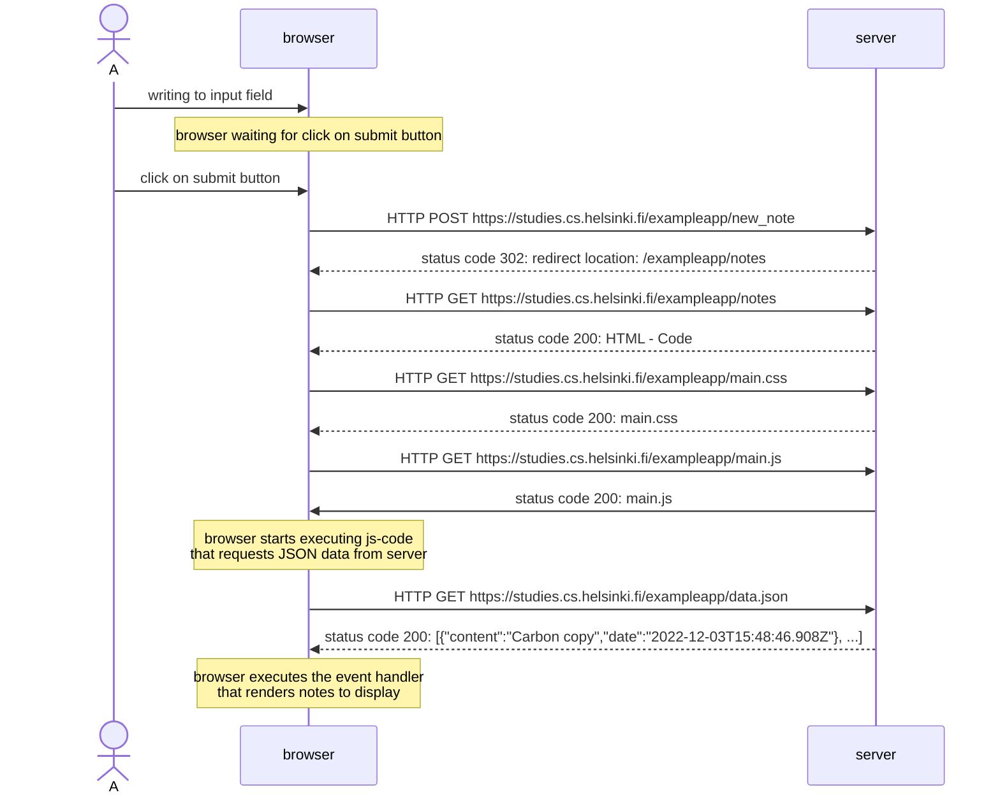

```mermaid
sequenceDiagram

actor A
A->>browser: writing to input field
note over browser: browser waiting for click on submit button
A->>browser: click on submit button
browser->>server: HTTP POST https://studies.cs.helsinki.fi/exampleapp/new_note
server-->>browser: status code 302: redirect location: /exampleapp/notes

browser->>server: HTTP GET https://studies.cs.helsinki.fi/exampleapp/notes
server-->>browser: status code 200: HTML - Code
browser->>server: HTTP GET https://studies.cs.helsinki.fi/exampleapp/main.css
server-->>browser: status code 200: main.css
browser->>server: HTTP GET https://studies.cs.helsinki.fi/exampleapp/main.js
server->>browser: status code 200: main.js

note over browser: browser starts executing js-code <br>that requests JSON data from server 


browser->>server: HTTP GET https://studies.cs.helsinki.fi/exampleapp/data.json
server-->>browser: status code 200: [{"content":"Carbon copy","date":"2022-12-03T15:48:46.908Z"}, ...]

note over browser: browser executes the event handler <br>that renders notes to display

```
