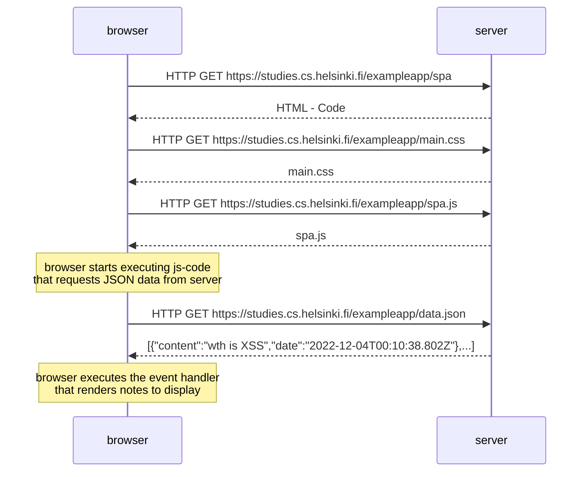

```mermaid
sequenceDiagram

browser->>server: HTTP GET https://studies.cs.helsinki.fi/exampleapp/spa
server-->>browser: HTML - Code
browser->>server: HTTP GET https://studies.cs.helsinki.fi/exampleapp/main.css
server-->>browser: main.css
browser->>server: HTTP GET https://studies.cs.helsinki.fi/exampleapp/spa.js
server-->>browser: spa.js

note over browser: browser starts executing js-code <br>that requests JSON data from server 

browser->>server: HTTP GET https://studies.cs.helsinki.fi/exampleapp/data.json
server-->>browser: [{"content":"wth is XSS","date":"2022-12-04T00:10:38.802Z"},...]

note over browser: browser executes the event handler <br>that renders notes to display

```
