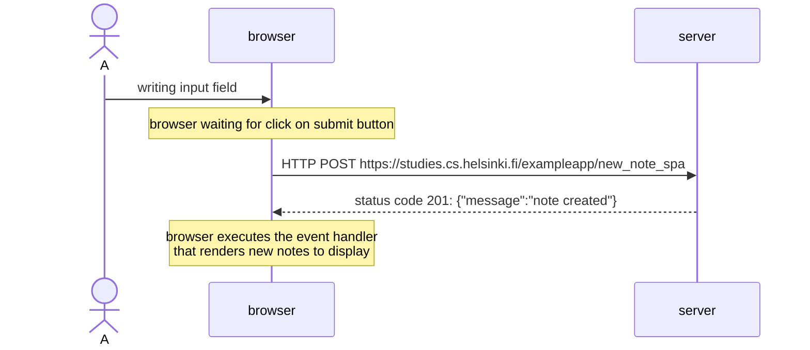

```mermaid
sequenceDiagram

actor A

A->>browser: writing input field
note over browser: browser waiting for click on submit button

browser->>server: HTTP POST https://studies.cs.helsinki.fi/exampleapp/new_note_spa
server-->>browser: status code 201: {"message":"note created"}

note over browser: browser executes the event handler <br>that renders new notes to display
```
